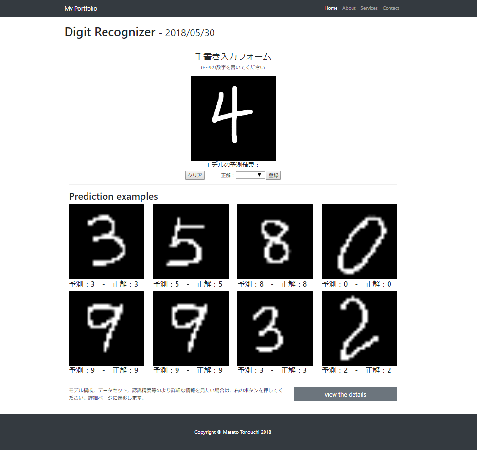

# My-Portfolio
Djangoを使ったWebアプリケーション作成の練習用リポジトリ

これまで自分が作ってきたDeepLearning系の実装を，作品集として見やすくまとめたWebアプリケーションを作成する

Wip（まだアプリ化はMNISTだけ）

## 利用フレームワーク
- Django2.1.3
- Bootstrap4
- Keras2.2.4
- Tensorflow1.11.0

## スクリーンショット

---------

## 作品集

### Digit Recognition（作成済み）
MNISTという手書き数字認識用のデータセット（28x28ピクセル）を使用

- 精度:99.4%
- 画面上に手書きした数字を識別させるアプリケーションを作成
- 入力された数字は再学習用に新たなデータセットとして登録する
- 直近の8例の識別結果を例として表示

後でREST Frameworkとか使ってちゃんとAPIにする（かも）
クソ設計になってるから後でちゃんとする（かも）
